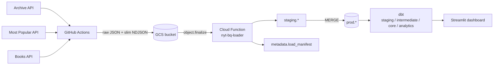

# Times API – NYT data pipeline

End-to-end pipeline that ingests three New York Times APIs, lands them in
BigQuery, models them with dbt, and surfaces them through a Streamlit
dashboard.

- **Archive API** – ~100 years of historical article metadata (1920–2019).
- **Most Popular API** – daily snapshot of the 20 most-viewed articles.
- **Books API** – weekly Best Sellers overview (~250 books across ~20 lists).

## Architecture



Each API has the same two-stage shape: **ingest** raw JSON, then **transform**
to slim NDJSON (one analysis-ready record per line). Raw is preserved as the
source of truth so transforms can be re-run without re-hitting rate-limited
APIs.

## Sources at a glance

| Source | Schedule | Workflow | Slim path | BigQuery table |
|---|---|---|---|---|
| Archive | manual | [`archive-ingest.yml`](.github/workflows/archive-ingest.yml) | `archive_slim/YYYY/MM.ndjson` | `prod.archive_articles` |
| Most Popular | daily 06:00 UTC | [`daily-ingest.yml`](.github/workflows/daily-ingest.yml) | `most_popular_slim/YYYY-MM-DD/viewed_30.ndjson` | `prod.most_popular_articles` |
| Books (Best Sellers) | Thu 08:00 UTC | [`books-ingest.yml`](.github/workflows/books-ingest.yml) | `books_slim/YYYY-MM-DD/overview.ndjson` | `prod.best_sellers` |

Detailed per-source docs: [`archive/`](archive/README.md),
[`most_popular/`](most_popular/README.md), [`books/`](books/README.md).

## Quickstart

```bash
# Install Python deps with uv (https://docs.astral.sh/uv/)
uv sync

# Drop your NYT key into .env
echo "NYTIMES_API_KEY=..." > .env

# Run one source end-to-end locally
uv run python -m most_popular.ingest
uv run python -m most_popular.transform
uv run python -m most_popular.validate_ge

# Build dbt models against BigQuery (after one-time GCP setup)
uv sync --group dbt
cd dbt_nyt_analytics && uv run dbt build
```

See per-component READMEs for full details:

| Component | Description |
|---|---|
| [`archive/`](archive/README.md) | Archive API ingest + transform (historical, ~100 years) |
| [`most_popular/`](most_popular/README.md) | Most Popular API ingest + transform + GE validation (daily) |
| [`books/`](books/README.md) | Best Sellers ingest + transform + GE validation (weekly) |
| [`cloud_function/`](cloud_function/README.md) | GCS → BigQuery loader (Eventarc-triggered) |
| [`infra/`](infra/README.md) | One-time BigQuery setup and Cloud Function deploy scripts |
| [`schema/`](schema/README.md) | Single source of truth for BigQuery table schemas |
| [`dbt_nyt_analytics/`](dbt_nyt_analytics/README.md) | dbt transformations (staging → intermediate → marts) |
| [`dashboard/`](dashboard/README.md) | Streamlit dashboard over BigQuery |
| [`docs/testing.md`](docs/testing.md) | Unified testing strategy (pytest, GE, dbt tests) |

## Conventions

- **Python**: 3.12, managed with [`uv`](https://docs.astral.sh/uv/). All
  scripts are run as modules: `uv run python -m <pkg>.<module>`.
- **Secrets**: `.env` at repo root (`NYTIMES_API_KEY`). Never committed.
- **Raw vs slim**: raw is the source of truth (`*_raw/`); slim is derived
  (`*_slim/`) and validated with Pydantic before write. Both are
  `.gitignore`d.
- **Idempotency**: every ingest step skips inputs that already exist
  (locally or in GCS); every loader checks `metadata.load_manifest` to
  avoid double-loading.
- **Quality gates**: ruff (lint + format), mypy, pytest, shellcheck, and
  Great Expectations all run in CI via
  [`quality.yml`](.github/workflows/quality.yml) and per-source workflows.
  See [`docs/testing.md`](docs/testing.md).
- **Pre-commit**: `uv run pre-commit install` once, then ruff/mypy/pytest
  run on every `git commit`.

## CI/CD

| Workflow | Trigger | Purpose |
|---|---|---|
| [`quality.yml`](.github/workflows/quality.yml) | push to main, PR | ruff, mypy, pytest, shellcheck |
| [`daily-ingest.yml`](.github/workflows/daily-ingest.yml) | cron 06:00 UTC | Most Popular ingest → transform → GE → GCS |
| [`books-ingest.yml`](.github/workflows/books-ingest.yml) | cron Thu 08:00 UTC | Best Sellers ingest → transform → GE → GCS |
| [`archive-ingest.yml`](.github/workflows/archive-ingest.yml) | manual | Archive ingest → transform → GCS (resumable from GCS) |
| [`deploy-function.yml`](.github/workflows/deploy-function.yml) | push to main (paths) | Deploy `nyt-bq-loader` Cloud Function |
| [`dbt-run.yml`](.github/workflows/dbt-run.yml) | cron 10:00 UTC + manual | Selective prod `dbt build` (`state:modified+`, `source_status:fresher+`) + docs artifact |
| [`dbt-deploy.yml`](.github/workflows/dbt-deploy.yml) | push to `main` (dbt paths) + manual | Prod `dbt build --select state:modified+` + docs artifact |
| [`dbt-docs-deploy.yml`](.github/workflows/dbt-docs-deploy.yml) | After successful dbt run or deploy | Publish docs to GitHub Pages |
| [`dbt-pr.yml`](.github/workflows/dbt-pr.yml) | PR touching `dbt_nyt_analytics/**` | `dbt build --select state:modified+ --defer --favor-state` into `ci_dbt_<PR>` |
| [`e2e-ci.yml`](.github/workflows/e2e-ci.yml) | PR touching ingest/CF/deps paths | Full smoke: 3 APIs → GE → CI bucket CF → `dbt build` into `ci_dbt_<PR>` |
| [`e2e-ci-cleanup.yml`](.github/workflows/e2e-ci-cleanup.yml) | PR closed (same paths) | Delete E2E CF, CI GCS prefix, `ci_*_<PR>` datasets |

### Required GitHub secrets

| Secret | Used by |
|---|---|
| `NYTIMES_API_KEY` | All ingest workflows |
| `GCP_SA_KEY_INGEST` | Ingest workflows uploading to GCS (Storage Object Creator) |
| `GCP_SA_KEY_DEPLOY` | `deploy-function.yml` (Cloud Functions deploy) |
| `GCP_SA_KEY` | `dbt-run.yml`, `dbt-deploy.yml`, `dbt-pr.yml`, E2E dbt step (BigQuery jobUser + dataEditor) |

Repo **variables**:
- `GCS_BUCKET` — prod ingest bucket (no `gs://`)
- `GCS_BUCKET_CI` — dedicated E2E CI bucket (prod loader must not listen here)
- `deploy-function.yml` / E2E also use `GCP_PROJECT`, `GCS_PREFIX`, `REGION`,
  `FUNCTION_NAME`, and the three BQ dataset variables — see
  [`infra/README.md`](infra/README.md). Optional `FUNCTION_RUNTIME_SA` for
  the Cloud Function runtime identity.

## Repository layout

```
.
├── archive/                # Archive API ingest + transform
├── most_popular/           # Most Popular API ingest + transform + GE
├── books/                  # Books API ingest + transform + GE
├── cloud_function/         # GCS → BigQuery loader (Cloud Function gen2)
├── infra/                  # One-time setup + deploy shell scripts
├── schema/                 # BigQuery table schemas (single source of truth)
├── dbt_nyt_analytics/      # dbt project
├── dashboard/              # Streamlit dashboard
├── tests/                  # pytest suite (transforms, GE expectations)
├── docs/                   # Cross-cutting docs (testing, brainstorm)
├── .github/workflows/      # CI and scheduled workflows
├── pyproject.toml          # Project deps and tool config
└── uv.lock                 # Locked deps for reproducible installs
```

Live dbt docs are built in [`dbt-run.yml`](.github/workflows/dbt-run.yml) and
[`dbt-deploy.yml`](.github/workflows/dbt-deploy.yml), then deployed by
[`dbt-docs-deploy.yml`](.github/workflows/dbt-docs-deploy.yml) after a
successful prod run (`https://mikael-lh.github.io/times-api/`).
